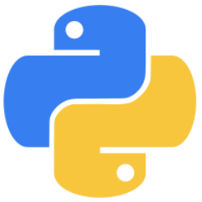

### Drew Bartleman

<!--        -->

## Skills

  <a href="https://www.python.org/">
  	
  <a href="https://en.wikipedia.org/wiki/JavaScript">
  	 
  <a href="https://nodejs.org/en/">
  	
  <a href="https://en.wikipedia.org/wiki/HTML">
  	
  <a href="https://en.wikipedia.org/wiki/CSS">
  	 
  <a href="https://reactjs.org/">
  	

## About Me

## Projects

## Contact

You can reach me by [sending me an email.](mailto:drewbartleman@gmail.com)